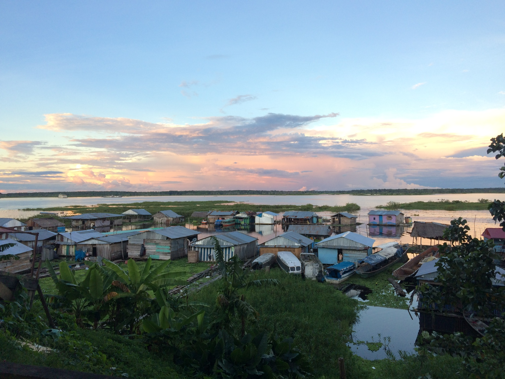
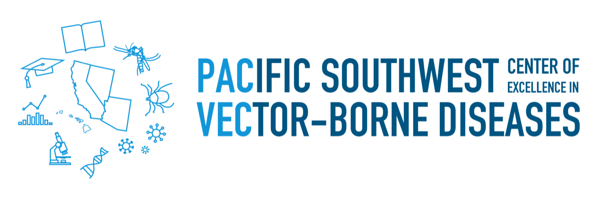
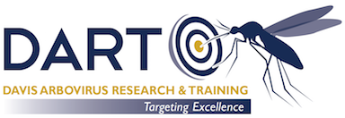

  <h4>I am a veterinarian training as a research epidemiologist with a focus on vector-borne diseases. Currently I am investigating arbovirus transmission dynamics by building statistical, mathematical and spatio-temporal models.<h4>
    <h4>PhD student, Epidemiology</h4>
  <h4><a href="https://barkerlab.ucdavis.edu/">Barker Lab</a></h4>
  <h5>UC Davis</h5>
  

  

  

  

  

